# 🚀 Cloud & DevOps Capstone Project Success Report

Welcome to the definitive success report for the Cloud & DevOps Capstone Project. This document showcases the successful end-to-end implementation of the modern DevSecOps lifecycle—from Infrastructure as Code and Configuration Management to Continuous Integration, GitOps Continuous Deployment, and Day-2 Observability.

---

## 🏗️ 1. Architecture & Infrastructure as Code (Terraform)
The foundation of the project relies on heavily secured, automated AWS infrastructure deployed via Terraform. 

### Project Architecture

### Network Isolation (VPCs)
The environment spans across isolated Development and Production VPCs. Private EKS nodes are fully locked away from the public internet, routing outbound traffic safely through NAT Gateways.
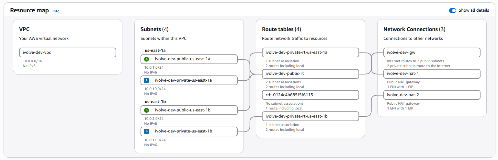
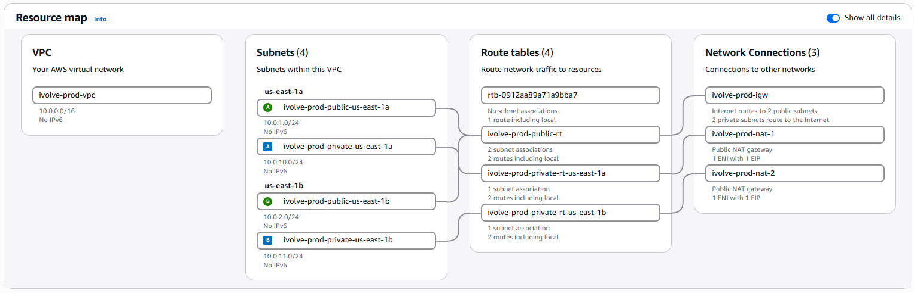

### Amazon EKS (Kubernetes)
The core compute layer. The cluster uses cost-optimized, Free-Tier eligible `m7i-flex.large` instances for maximum pod density and efficiency. 
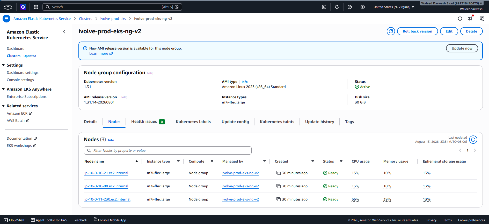

### Least Privilege IAM
AWS Access Keys were explicitly avoided. The Jenkins CI server interacts with ECR and EKS using temporary, auto-rotating credentials provided by an IAM Instance Profile.
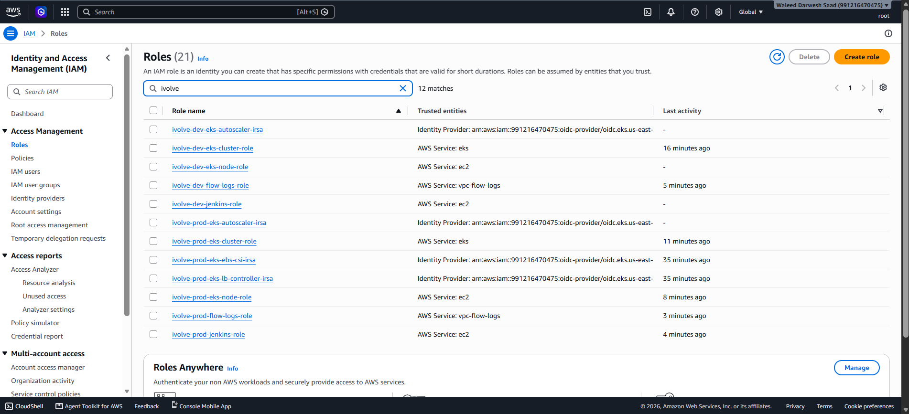

---

## ⚙️ 2. Continuous Integration & DevSecOps (Jenkins)
The CI pipelines automatically build, test, and scan code on every commit. The logic is centralized using a Groovy Shared Library.

### Jenkins Automation Server
Configured automatically using Ansible.
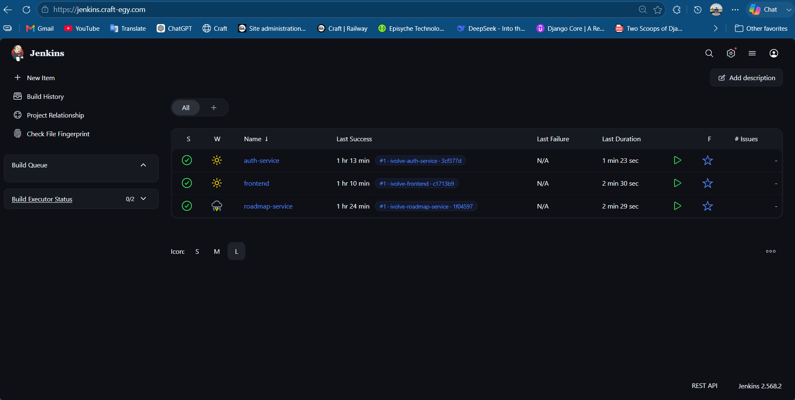

### Pipeline Success
A 9-stage declarative pipeline dynamically runs language-specific builds for all microservices.

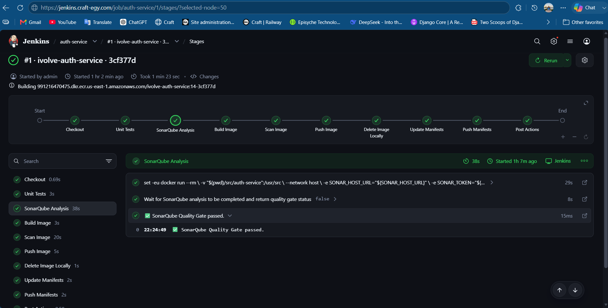
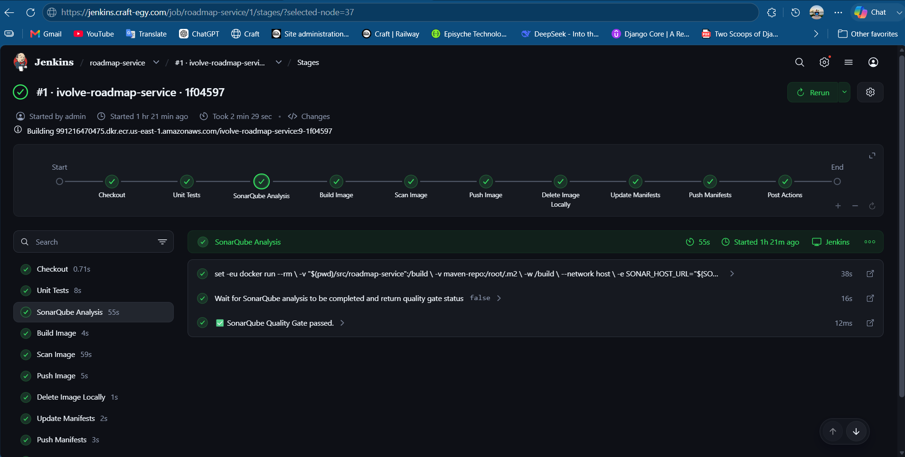

### Security & Quality Gates (DevSecOps)
Code is analyzed by SonarQube, and the built Docker images are strictly scanned by Trivy before they are allowed into the registry. Images with fixable CRITICAL vulnerabilities are blocked from deployment.
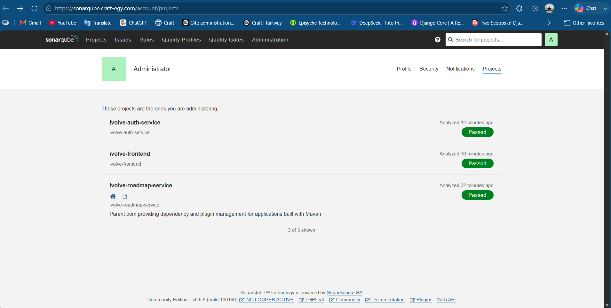
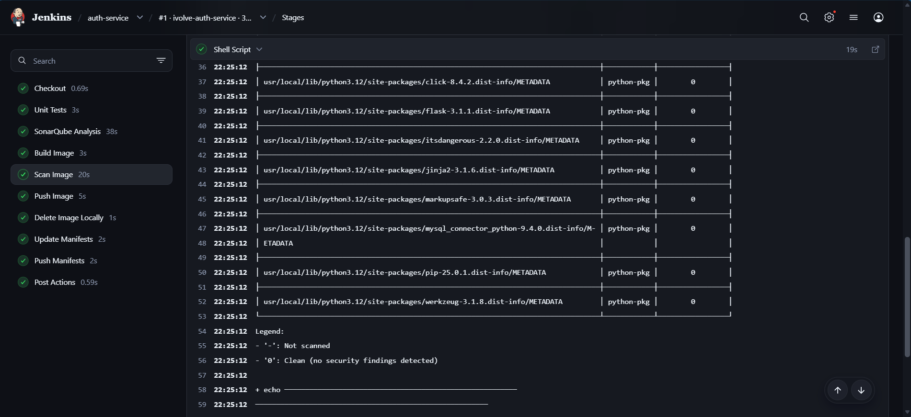

### Elastic Container Registry (ECR)
Successfully built images are pushed to AWS ECR using an immutable tagging strategy (tagged with specific Git commit hashes).
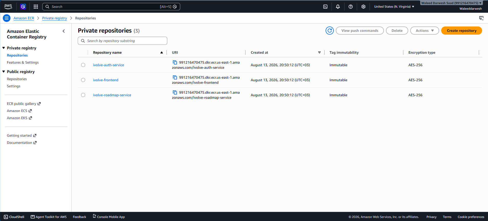

---

## 🔄 3. GitOps Continuous Deployment (ArgoCD)
Deployments are handled entirely through GitOps principles. Jenkins never connects to Kubernetes directly.

### Automated GitOps Commits
At the end of a successful CI pipeline, Jenkins automatically updates the Kustomize manifests and commits the new image tags back to GitHub.
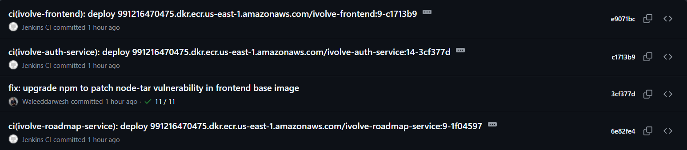

### ArgoCD Synchronization
ArgoCD continuously monitors the manifest repository and automatically syncs the live Kubernetes cluster to match the Git state, providing self-healing deployments.
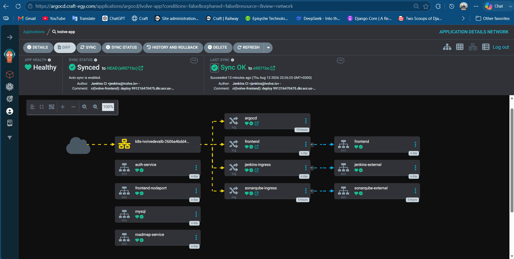

---

## 📊 4. Observability & End Result
Day-2 operations and final application validation.

### Kubernetes Workloads
All microservices dynamically scheduled and running healthily across the EKS worker nodes.
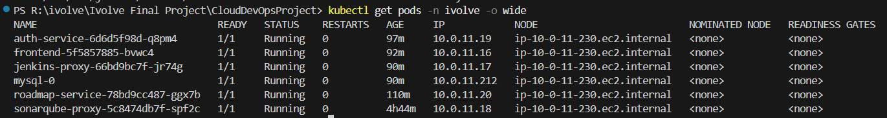

### Cluster Monitoring (Prometheus & Grafana)
A fully functioning Prometheus/Grafana stack providing deep visibility into node performance, pod health, and resource consumption.
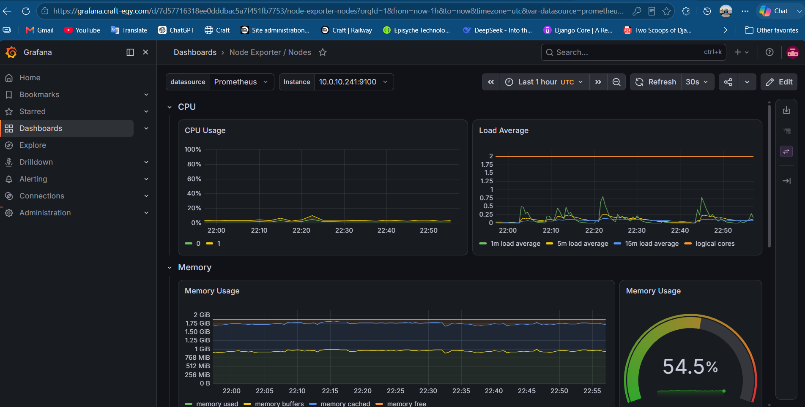

### The Final Product
The live, internet-facing application successfully deployed and accessible to end users!
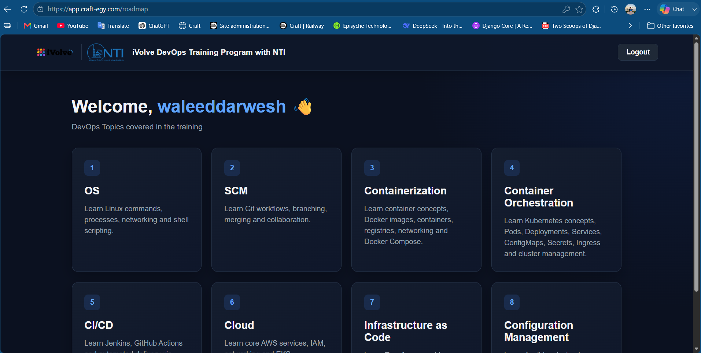

---
**🏆 Project Status: SUCCESS**
