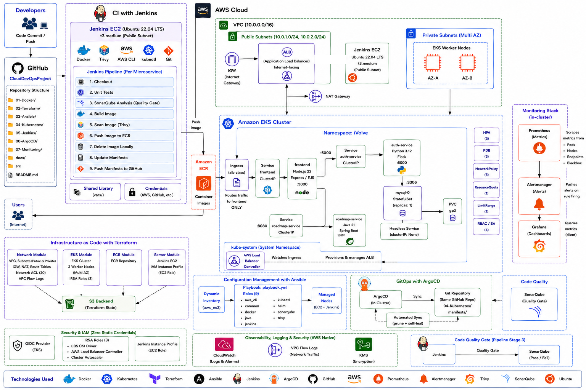
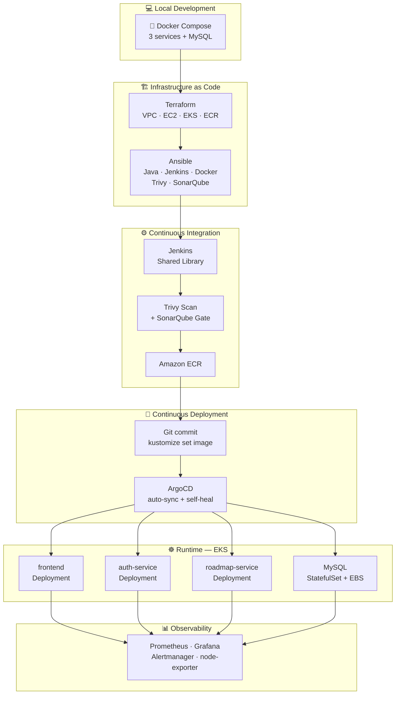

<div align="center">

# ☁️ Cloud DevOps Capstone — iVolve Technologies

**A production-grade, end-to-end cloud-native platform: three microservices taken from raw source code to a running, monitored, GitOps-managed deployment on AWS EKS.**


<br/>

### 👉 **[START HERE — step-by-step execution checklist](START-HERE.md)** 👈

*Want to actually run this? That file lists every action you take, in order, with the exact command.*
*This README explains **what** was built and **why**.*

<br/>

### 🎓 **[Build it yourself instead — CloudDevOpsProject-Manual](https://github.com/Waleeddarwesh/CloudDevOpsProject-Manual)**

*This repository is the finished article. The Manual is the same platform with the files removed:*
*eight guided modules where you write every line, and this repo is the answer key you check against.*

</div>

---

## 📑 Table of Contents

- [Overview](#overview)
- [Architecture Overview](#architecture-overview)
- [The Application](#the-application)
- [Delivery Pipeline](#delivery-pipeline)
- [Tech Stack](#tech-stack)
- [Repository Structure](#repository-structure)
- [Phase Catalog](#phase-catalog)
- [Internship Labs Applied](#internship-labs-applied)
- [Quick Start](#quick-start)
- [Validation Status](#validation-status)
- [Production Enhancements](#production-enhancements)
- [Documentation](#documentation)
- [Cost Estimate](#cost-estimate)
- [Cleanup](#cleanup)
- [Contact](#contact)

---

<a id="overview"></a>

## 📖 Overview

This is the capstone project of the **iVolve Technologies Cloud DevOps internship** — the point where all 29 labs converge into one system.

It takes a **three-service microservices application** and builds every layer required to run it securely and at scale in the cloud: local containerisation, modular infrastructure as code, automated server configuration, Kubernetes orchestration, a CI pipeline with security and quality gates, GitOps continuous deployment, and a full observability stack.

Every directory carries a dedicated `README.md` with **line-by-line explanations** of the code, so this repository works both as a deployable platform and as a reference.

> **A note on rigour.** Nothing here is aspirational. The Terraform plans cleanly against a live AWS account (**81 resources, 0 errors**), all 37 Kubernetes objects pass **`kubeconform --strict`** against the real Kubernetes 1.31 schemas, and the Compose stack passes `docker compose config`. See [Validation Status](#validation-status).

---

<a id="architecture-overview"></a>

## 🗺️ Architecture Overview





**The flow in one sentence:** Terraform builds the cloud, Ansible configures the CI server, Jenkins builds and *gates* the images, Git records the desired state, ArgoCD reconciles the cluster to it, and Prometheus watches the result.

---

<a id="the-application"></a>

## 🧩 The Application

The source is [`Ibrahim-Adel15/iVolveFinalProject`](https://github.com/Ibrahim-Adel15/iVolveFinalProject) — a DevOps Roadmap web app, vendored into [`src/`](src/) at commit `aa60d92`.

| Service | Stack | Port | Talks to | Stateful |
|---|---|:---:|---|:---:|
| [`frontend`](src/frontend/) | Node.js 22 · Express 5 · EJS | `3000` | auth + roadmap | ❌ |
| [`auth-service`](src/auth-service/) | **Python 3.12 · Flask** · bcrypt | `5000` | MySQL | ❌ |
| [`roadmap-service`](src/roadmap-service/) | **Java 21 · Spring Boot 3.5.4** | `8080` | — | ❌ |
| `mysql` | MySQL 8.0 | `3306` | — | ✅ |

```text
                       ┌───────────────┐
                       │    Browser    │
                       └───────┬───────┘
                               │ HTTP :3000
                               ▼
                    ┌──────────────────────┐
                    │   frontend (Node)    │  ← only public service
                    └──────┬────────┬──────┘
                           │        │
              POST /login  │        │  GET /api/roadmap
                           ▼        ▼
         ┌──────────────────────┐  ┌────────────────────────┐
         │ auth-service (Flask) │  │ roadmap-service (Boot) │
         └──────────┬───────────┘  └────────────────────────┘
                    │ :3306                  stateless
                    ▼
         ┌──────────────────────┐
         │   MySQL StatefulSet  │
         └──────────────────────┘
```

> ⚠️ **Corrections applied to the upstream documentation.** The upstream `README.md` states that auth-service is Java and roadmap-service is Python. **The actual code is the reverse** — verified against `auth-service/app.py` (Flask) and `roadmap-service/pom.xml` (Spring Boot). All manifests, Dockerfiles and pipelines in this repository follow the *code*, not the upstream README. Likewise, `app.py` reads `DB_USER` — **not** `DB_USERNAME`.

---

<a id="delivery-pipeline"></a>

## 🔁 Delivery Pipeline

```text
  git push (application code)
        │
        ▼
  ┌──────────────────────── Jenkins ────────────────────────┐
  │  Checkout → tag = <build>-<git-sha>                     │
  │  Unit Tests      (containerised, per language)          │
  │  SonarQube       + Quality Gate                         │
  │  Build Image     (multi-stage, non-root)                │
  │  Scan Image      Trivy — CRITICAL+fixable ⇒ BUILD FAILS │
  │  Push Image      → ECR (IAM instance profile, no keys)  │
  │  Delete Local    reclaim disk                           │
  │  Update Manifest kustomize edit set image               │
  │  Push Manifest   git commit [skip ci]                   │
  └──────────────────────────┬──────────────────────────────┘
                             │  Git is now the source of truth
                             ▼
  ┌──────────────────────── ArgoCD ─────────────────────────┐
  │  detects the new revision                               │
  │  syncs by wave: DB(1) → backends(2) → frontend(3) → ALB(4)
  │  prune + selfHeal keep the cluster equal to Git         │
  └─────────────────────────────────────────────────────────┘
```

**The security gate is real.** Trivy runs *before* the push, so an image with a fixable `CRITICAL` CVE never reaches the registry. See [`vars/trivyScan.groovy`](05-Jenkins/vars/trivyScan.groovy).

---

<a id="tech-stack"></a>

## 🛠 Tech Stack

| Category | Technologies |
|---|---|
| **Cloud** | AWS — VPC, EC2, EKS, ECR, S3, IAM, KMS, CloudWatch, NAT Gateway, ALB |
| **IaC** | Terraform 1.10+ (4 custom modules, S3 backend with native locking) |
| **Config Management** | Ansible (9 roles, Vault, AWS dynamic inventory) |
| **Containers** | Docker, BuildKit, Docker Compose v2 |
| **Orchestration** | Kubernetes 1.31, Kustomize, EBS CSI, AWS Load Balancer Controller |
| **CI** | Jenkins (Groovy Shared Library, 8 reusable steps) |
| **CD** | ArgoCD (AppProject, sync waves, self-heal) |
| **Security** | Trivy, SonarQube, Checkov, Gitleaks, hadolint, IRSA, Pod Security Standards, NetworkPolicy |
| **Observability** | Prometheus, Grafana, Alertmanager, node-exporter, kube-state-metrics, blackbox-exporter |
| **Languages** | Node.js 22, Python 3.12, Java 21, Groovy, HCL, Bash, YAML |

---

<a id="repository-structure"></a>

## 📂 Repository Structure

```text
CloudDevOpsProject/
│
├── src/                              # Application source (vendored @ aa60d92)
│   ├── frontend/                     #   Node.js · hardened multi-stage Dockerfile
│   ├── auth-service/                 #   Python  · hardened multi-stage Dockerfile
│   └── roadmap-service/              #   Java    · hardened multi-stage Dockerfile
│
├── 01-Docker/                        # Phase 1 — local stack
│   ├── docker-compose.yml
│   └── .env.example
│
├── 02-Terraform/                     # Phase 2 — AWS infrastructure
│   ├── bootstrap/                    #   S3 remote-state bucket (run once)
│   ├── main.tf  variables.tf  outputs.tf  locals.tf  providers.tf  versions.tf
│   ├── backend.tf  backend.hcl.example  terraform.tfvars.example
│   └── modules/
│       ├── network/                  #   VPC, subnets, IGW, NAT, NACLs, flow logs
│       ├── server/                   #   Jenkins EC2, SG, IAM profile, IMDSv2
│       ├── eks/                      #   cluster, nodes, OIDC, IRSA, add-ons, access
│       └── ecr/                      #   repositories, lifecycle, immutable tags
│
├── 03-Ansible/                       # Phase 3 — server configuration
│   ├── ansible.cfg  playbook.yml  requirements.yml
│   ├── inventory/aws_ec2.yml         #   dynamic inventory
│   ├── group_vars/all/               #   main.yml + Vault template
│   └── roles/                        #   common java docker jenkins trivy
│                                     #   aws_cli kubectl helm sonarqube
│
├── 04-Kubernetes/                    # Phase 4 — orchestration
│   └── manifests/
│       ├── 00-namespace.yaml         #   Namespace, ResourceQuota, LimitRange
│       ├── 01-rbac.yaml              #   ServiceAccounts, Roles, RoleBindings
│       ├── 02-config.yaml            #   ConfigMap, Secret
│       ├── 03-storage.yaml           #   StorageClass (EBS CSI)
│       ├── 04-database.yaml          #   Headless Service + StatefulSet
│       ├── 05-auth-service.yaml      #   Deployment, Service, HPA, PDB
│       ├── 06-roadmap-service.yaml   #   Deployment, Service, HPA, PDB
│       ├── 07-frontend.yaml          #   Deployment, Service, NodePort, HPA, PDB
│       ├── 08-ingress.yaml           #   ALB Ingress
│       ├── 09-network-policies.yaml  #   default-deny + per-service rules
│       └── kustomization.yaml        #   image substitution target
│
├── 05-Jenkins/                       # Phase 5 — CI
│   ├── Jenkinsfiles/                 #   one thin file per service
│   └── vars/                         #   shared library (7 steps)
│
├── 06-ArgoCD/                        # Phase 6 — CD
│   ├── project.yaml                  #   AppProject (the security boundary)
│   └── applications/ivolve-app.yaml
│
├── 07-Monitoring/                    # Phase 7 — observability
│   ├── kube-prometheus-stack-values.yaml
│   ├── manifests/                    #   Probes, PrometheusRule, dashboard CM
│   └── dashboards/                   #   Grafana JSON source
│
├── docs/                             # Deep-dive documentation
│   ├── ARCHITECTURE.md  SETUP.md  CICD.md  SECURITY.md
│   ├── MONITORING.md  RUNBOOK.md  TROUBLESHOOTING.md
│   └── TECHNOLOGY-ROADMAP.md         #   performance · HA · security roadmap
│
├── scripts/
│   └── sync-shared-library.sh        # mirrors vars/ to the Jenkins library repo
│
├── .github/
│   ├── workflows/ci.yml              # infra-code validation on every push
│   ├── ISSUE_TEMPLATE/               # bug report · feature request
│   ├── PULL_REQUEST_TEMPLATE.md      # with a Terraform-impact checklist
│   ├── CODEOWNERS                    # review gates on security-sensitive paths
│   └── dependabot.yml                # weekly base-image + dependency updates
│
├── Makefile                          # `make help` — every task
├── CONTRIBUTING.md                   # branching, commits, definition of done
├── SECURITY.md                       # vulnerability disclosure policy
├── LICENSE                           # MIT + upstream attribution
├── .gitignore  .editorconfig  .yamllint.yml
└── README.md
```

---

<a id="phase-catalog"></a>

## 📚 Phase Catalog

| Phase | Directory | What It Delivers | Status |
|:---:|---|---|:---:|
| **1** | [🐳 `01-Docker`](01-Docker/) | Compose v2 stack — 3 services + MySQL, healthcheck-gated startup, custom bridge network, named volume, resource limits | ✅ |
| **2** | [🏗️ `02-Terraform`](02-Terraform/) | 4 modules + bootstrap. VPC across 2 AZs, NACLs, flow logs, Jenkins EC2 with IMDSv2 + IAM profile, EKS with OIDC/IRSA/add-ons, ECR with immutable tags | ✅ |
| **3** | [🤖 `03-Ansible`](03-Ansible/) | 9 roles, Ansible Vault, AWS dynamic inventory, idempotent, FQCN throughout | ✅ |
| **4** | [☸️ `04-Kubernetes`](04-Kubernetes/) | 37 objects — StatefulSet, headless Service, CSI StorageClass, init containers, 3-probe strategy, HPA, PDB, NetworkPolicy, RBAC, quota | ✅ |
| **5** | [⚙️ `05-Jenkins`](05-Jenkins/) | Groovy shared library — 8 reusable steps, 9 stages, Trivy gate, SonarQube gate, Kustomize-based manifest update | ✅ |
| **6** | [🔄 `06-ArgoCD`](06-ArgoCD/) | AppProject with a whitelisted resource set, Application with prune + self-heal, sync waves, retry backoff | ✅ |
| **7** | [📊 `07-Monitoring`](07-Monitoring/) | kube-prometheus-stack, node-exporter DaemonSet, black-box probes, 12 alert rules, version-controlled Grafana dashboard | ✅ |

---

<a id="internship-labs-applied"></a>

## 🎓 Internship Labs Applied

Every one of the 29 labs from the [internship journey](https://github.com/WaleedDarwesh/ivolve-cloud-devops-internship) is exercised here:

| Track | Labs | Where It Appears |
|---|---|---|
| 🔨 **Build Tools** | 01 Gradle · 02 Maven | Maven build in [`roadmap-service/Dockerfile`](src/roadmap-service/Dockerfile); `mvn test` stage in [`runUnitTests.groovy`](05-Jenkins/vars/runUnitTests.groovy) |
| 🐳 **Docker** | 03-05 containers & multi-stage · 06 env vars · 07 volumes · 08 custom network · 09 Compose | All three [`Dockerfiles`](src/) are multi-stage; [`docker-compose.yml`](01-Docker/docker-compose.yml) uses a user-defined bridge, a named volume and `.env` |
| ☸️ **Kubernetes** | 10 taints · 11 namespaces + quota · 12 ConfigMap/Secret · 13 PV · 14 StatefulSet + headless · 15 Deployment + ClusterIP · 16 init containers · 16+ NodePort/Ingress · 17 resources · 18 NetworkPolicy · 19 DaemonSet · 20 RBAC · 20+ monitoring | [`00-namespace`](04-Kubernetes/manifests/00-namespace.yaml) · [`01-rbac`](04-Kubernetes/manifests/01-rbac.yaml) · [`04-database`](04-Kubernetes/manifests/04-database.yaml) · [`09-network-policies`](04-Kubernetes/manifests/09-network-policies.yaml) · [`07-Monitoring`](07-Monitoring/) |
| ⚙️ **Jenkins** | 21 RBAC · 22 CI/CD pipeline · 23 shared library | [`05-Jenkins/vars/`](05-Jenkins/vars/) — matrix-auth + role-strategy plugins provisioned by the [`jenkins` role](03-Ansible/roles/jenkins/) |
| 🔄 **ArgoCD** | 24 GitOps workflow | [`06-ArgoCD/`](06-ArgoCD/) |
| 🤖 **Ansible** | 25 initial config · 26 playbooks · 27 roles · 28 **Vault** · 29 **dynamic inventory** | [`03-Ansible/`](03-Ansible/) — 9 roles, [`vault.yml.example`](03-Ansible/group_vars/all/vault.yml.example), [`aws_ec2.yml`](03-Ansible/inventory/aws_ec2.yml) |

---

<a id="quick-start"></a>

## 🚀 Quick Start

```bash
make help          # see every available task
```

### 1 · Run locally (no AWS required)

```bash
cp 01-Docker/.env.example 01-Docker/.env
# edit .env — replace every CHANGE_ME value
make up            # → http://localhost:3000
```

### 2 · Provision AWS

```bash
make tf-bootstrap                       # create the S3 state bucket (once)
cp 02-Terraform/backend.hcl.example 02-Terraform/backend.hcl
cp 02-Terraform/terraform.tfvars.example 02-Terraform/terraform.tfvars
# set allowed_ssh_cidrs to YOUR_IP/32 — Terraform refuses 0.0.0.0/0
make tf-init && make tf-plan && make tf-apply
```

### 3 · Configure Jenkins

```bash
make ansible-deps
cd 03-Ansible && openssl rand -base64 32 > .vault_pass && chmod 600 .vault_pass
make vault-create                       # then edit the secrets
make ansible-inventory                  # confirm the EC2 host is discovered
make ansible-run
```

### 4 · Deploy

```bash
make kubeconfig
make argo-install && make argo-apply
make mon-install
make k8s-status
```

Full instructions, including the AWS Load Balancer Controller and the Jenkins shared-library setup, are in **[START-HERE.md](START-HERE.md)**.

---

<a id="validation-status"></a>

## ✅ Validation Status

Every layer is machine-verified, not just written.

| Layer | Tool | Result |
|---|---|---|
| Terraform | `terraform validate` | ✅ Success |
| Terraform | `terraform fmt -check -recursive` | ✅ All formatted |
| Terraform | **`terraform plan` vs live AWS** | ✅ **81 to add, 0 errors** |
| Kubernetes | `kubectl kustomize` | ✅ 37 objects rendered |
| Kubernetes | **`kubeconform --strict` (K8s 1.31)** | ✅ **37/37 valid, 0 invalid** |
| Docker Compose | `docker compose config` | ✅ Valid |
| Ansible | YAML parse, 40 files | ✅ 40/40 OK |
| Grafana dashboard | JSON + embedded-YAML parse | ✅ Valid |

> The live `terraform plan` caught a genuine defect that offline validation cannot see: an `Invalid count argument` in the EKS access-entry resource, where `count` depended on an ARN unknown until apply. It is fixed in [`modules/eks/variables.tf`](02-Terraform/modules/eks/variables.tf) and documented there.

---

<a id="production-enhancements"></a>

## 🏭 Production Enhancements

Beyond the brief, these are the changes that separate a lab exercise from a system you would actually operate:

| Area | Enhancement | Why It Matters |
|---|---|---|
| 🛡️ **Identity** | IAM instance profile + **IRSA**, zero static keys | A leaked `AKIA…` key is the usual path from CI compromise to account compromise |
| 🛡️ **Metadata** | **IMDSv2 enforced** (`http_tokens = required`) | Blocks SSRF-based credential theft |
| 🛡️ **Secrets** | KMS envelope encryption of etcd Secrets; Ansible Vault; documented Sealed Secrets / ESO paths | Base64 is encoding, not encryption |
| 🔒 **TLS** | **ALB + ACM integration** for `*.craft-egy.com` | Full HTTPS termination at the edge with automated certificate validation |
| 🛡️ **Network** | Public + private **NACLs**, VPC **flow logs**, default-deny **NetworkPolicy** | Defence in depth; flow logs are the only way to debug a silent drop |
| 🔐 **Pods** | **Pod Security Standard `restricted`**, non-root, `readOnlyRootFilesystem`, all capabilities dropped | Non-compliant pods are *rejected at admission* |
| 🔐 **Registry** | **Immutable ECR tags** + lifecycle policy | A tag that can be overwritten makes rollback a lie |
| 🛡️ **CI gates** | Trivy (blocking), SonarQube quality gate, Checkov, Gitleaks, hadolint | Shift-left, enforced rather than advisory |
| 📊 **Observability** | Prometheus + Grafana + Alertmanager, 12 alert rules with runbook links, **black-box probes** | Works without modifying the upstream app |
| ⚖️ **Resilience** | HPA (v2 with `behavior`), **PDB**, topology spread, 3-probe strategy, `preStop` drain | Zero-downtime rollouts and safe node drains |
| 💰 **Cost** | Optional single NAT, ECR lifecycle expiry, log retention caps, `default_tags` for cost allocation | Lab bills get out of hand fast |
| 🔁 **Reproducibility** | Pinned provider/package versions, `.terraform.lock.hcl` committed, Kustomize over `sed` | The build you run in six months is the same build |

---

<a id="documentation"></a>

## 📖 Documentation

| Document | Contents |
|---|---|
| [docs/ARCHITECTURE.md](docs/ARCHITECTURE.md) | Component design, data flow, network topology, design decisions and trade-offs, known limitations |
| [START-HERE.md](START-HERE.md) | Complete zero-to-running walkthrough with expected output at each step |
| [docs/CICD.md](docs/CICD.md) | Pipeline internals, shared-library API, Jenkins configuration, RBAC and agents |
| [docs/SECURITY.md](docs/SECURITY.md) | Threat model, secrets strategy, IAM/RBAC layers, hardening checklist |
| [docs/MONITORING.md](docs/MONITORING.md) | Metrics architecture, alert catalogue, dashboards, white-box upgrade path |
| [docs/RUNBOOK.md](docs/RUNBOOK.md) | Incident procedures linked from alert annotations |
| [docs/TROUBLESHOOTING.md](docs/TROUBLESHOOTING.md) | Symptom-driven fixes for the failure modes this stack actually produces |
| [docs/TECHNOLOGY-ROADMAP.md](docs/TECHNOLOGY-ROADMAP.md) | **Technologies to reach high performance, high availability and high security** — phased, costed, with an explicit "deliberately not recommended" list |

Each phase directory also carries its own README with line-by-line code explanations.

**Repository conventions:** [CONTRIBUTING.md](CONTRIBUTING.md) (branching, commit format, definition of done) · [SECURITY.md](SECURITY.md) (disclosure policy)

---

<a id="cost-estimate"></a>

## 💰 Cost Estimate

Approximate `us-east-1` on-demand pricing for a continuously-running environment:

| Resource | Configuration | ~Monthly |
|---|---|---:|
| EKS control plane | 1 cluster | $73 |
| EKS worker nodes | 3 × m7i-flex.large | $0 (Free Tier) |
| Jenkins server | 1 × t3.small + 50 GB gp3 | ~$4 (EBS overage) |
| NAT Gateway | 1 shared (`single_nat_gateway = true`) | $33 |
| Application Load Balancer | 1 ALB | $17 |
| EBS volumes | MySQL 10 GB + Prometheus 20 GB + nodes | $8 |
| ECR, S3, CloudWatch, KMS | low volume | ~$5 |
| | **Total** | **≈ $231/mo** |

**Cost controls built in:** `single_nat_gateway` (saves ~$33/AZ), ECR lifecycle expiry, CloudWatch retention caps, `SPOT` capacity supported via `node_capacity_type`, and `make tf-destroy` for a clean teardown.

> 💡 Run `make tf-destroy` whenever you are not actively demoing. The EKS control plane bills hourly whether or not anything is deployed.

---

<a id="cleanup"></a>

## 🧹 Cleanup

```bash
# 1. Remove the ArgoCD Application first — its finalizer cascades to the workloads
kubectl delete -f 06-ArgoCD/applications/

# 2. Delete the Ingress so the ALB is released before the VPC is destroyed
kubectl delete ingress frontend -n ivolve

# 3. Destroy the infrastructure
make tf-destroy

# 4. Delete the state bucket (must be emptied first — versioning is enabled)
cd 02-Terraform/bootstrap && terraform destroy
```

> ⚠️ **Order matters.** Destroying the VPC before the ALB is released leaves an orphaned load balancer whose ENIs block the VPC deletion, and `terraform destroy` hangs for 20 minutes before failing. The `StorageClass` uses `reclaimPolicy: Retain`, so the MySQL EBS volume survives on purpose — delete it manually when you no longer need the data.

---

<a id="contact"></a>

## 📬 Contact

<div align="center">

[](https://www.linkedin.com/in/waleeddarwesh1)
[](https://github.com/WaleedDarwesh)
[](mailto:Waleeddarweshsaad1@gmail.com)

**Internship journey:** [ivolve-cloud-devops-internship](https://github.com/WaleedDarwesh/ivolve-cloud-devops-internship) — all 29 labs

</div>

---

<div align="center">

### 🏆 **[View Project Success Report & Screenshots](PROJECT_SUCCESS.md)** 🏆
*A massive gallery proving the successful deployment of the architecture, pipelines, GitOps, and monitoring.*

<br/>

_Built as the capstone of the iVolve Technologies Cloud DevOps internship._

</div>
