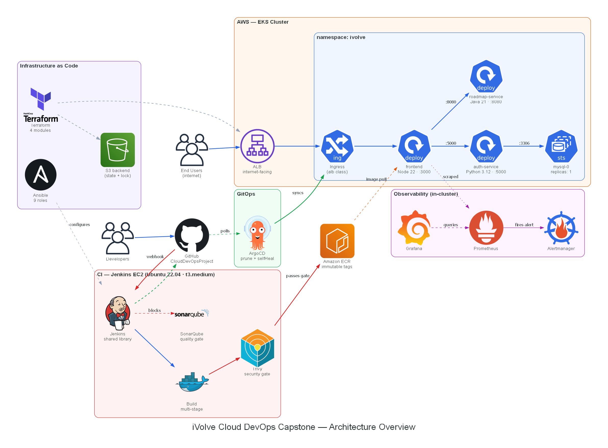
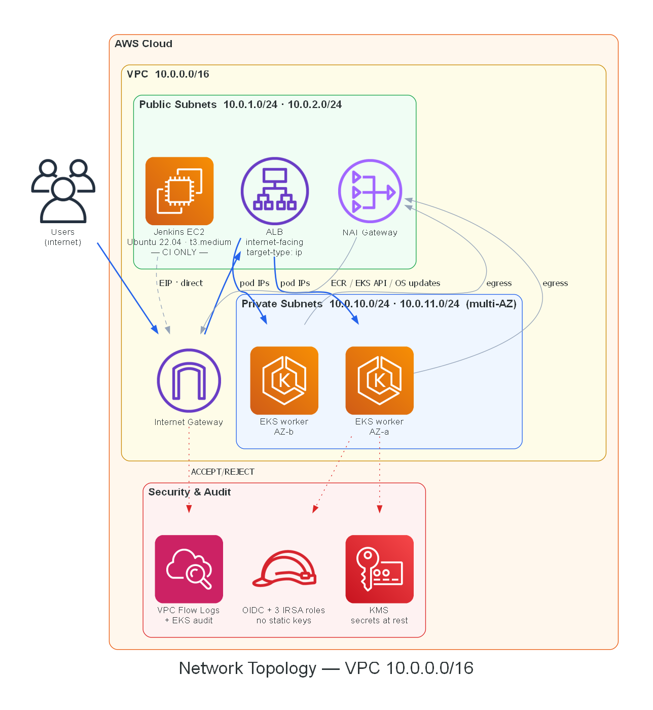
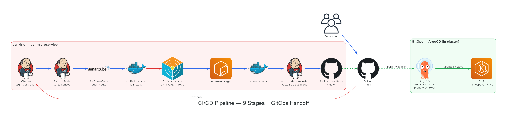
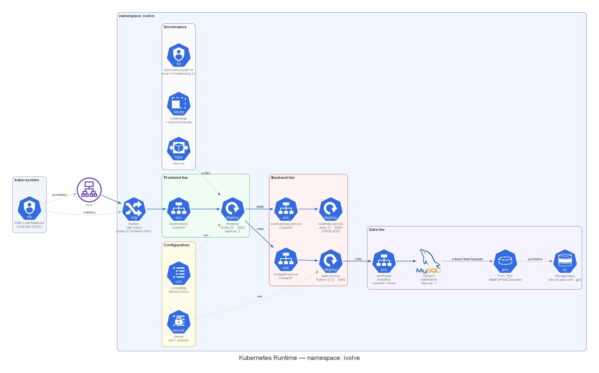

# 📐 Architecture Diagrams

**These images are generated from code, not drawn by hand.**

Source: [`scripts/generate_diagrams.py`](../../scripts/generate_diagrams.py)

---

## 📑 The four diagrams

### 1 · Architecture Overview

The whole platform end to end — commit → build → gate → registry → Git → reconcile → run → observe.



---

### 2 · Network Topology

VPC layout and the exact path a user request takes.



> 💡 **The key detail:** the ALB routes into the cluster, **not** through the Jenkins server. Jenkins shares the public subnet but is never on the request path — it only pushes images to ECR and commits to Git.

---

### 3 · CI/CD Pipeline

The nine pipeline stages and the GitOps handoff.



> 💡 **The pipeline ends at a Git commit.** Jenkins holds no deployment credentials. ArgoCD — running *inside* the cluster — pulls the change.

---

### 4 · Kubernetes Runtime

What actually runs inside the cluster: 37 rendered objects.



---

## 🔄 Regenerating

```bash
# One-time setup
pip install diagrams

# Graphviz BINARY is also required — the pip package is only the bindings
winget install Graphviz.Graphviz     # Windows
brew install graphviz                # macOS
sudo apt-get install graphviz        # Ubuntu

# Render
make diagrams
#   or: python scripts/generate_diagrams.py
```

---

## 🤔 Why diagrams-as-code

A hand-drawn diagram drifts. Every re-export or regeneration silently changes details — an arrow appears between two services that never talk to each other, a database gains a replica it does not have, a load balancer starts routing through the CI server.

This project's diagram went through **eleven** hand-drawn revisions. Across them, the same three errors kept reappearing after being fixed:

| Recurring error | Times it regressed |
|---|:---:|
| `auth-service → roadmap-service` arrow (this call does not exist) | 5 |
| `ALB → Jenkins EC2` arrow (CI is not in the request path) | 7 |
| `roadmap-service` Deployment box vanishing | 2 |

One revision even invented a **MySQL primary/replica cluster** — the StatefulSet has `replicas: 1`, and the manifest carries an explicit warning that raising it produces two independent empty databases.

Here the arrows are **code**. They appear in `git diff`, they are reviewable in a pull request, and they cannot change unless someone edits the script.

---

## ✅ Verified against the manifests

Every edge was checked against the rendered output of:

```bash
kubectl kustomize 04-Kubernetes/manifests
```

**The service graph — and what is deliberately absent:**

```text
Ingress ──► svc/frontend ──► frontend
                               ├──:5000──► svc/auth-service ──► auth-service ──:3306──► mysql-0
                               └──:8080──► svc/roadmap-service ──► roadmap-service

MUST NOT EXIST:
  auth-service   ──► roadmap-service     they never interact
  roadmap-service ──► mysql              it is stateless, holds no DB credentials
  ALB            ──► Jenkins EC2         CI is not in the request path
```

These constraints are enforced at runtime by **6 NetworkPolicies** with a `default-deny-all` baseline — so the diagram and the cluster agree by construction.

**Edge semantics** are consistent across all four diagrams:

| Style | Meaning |
|---|---|
| **Solid blue** | Real traffic or artefacts move along this edge |
| **Dashed grey** | A controller observing or provisioning — no traffic flows |
| **Dashed green** | The GitOps reconciliation loop |
| **Solid red** | The security path (build → scan → gate) |

---

## ⚠️ Two implementation notes

**Alertmanager icon.** The `diagrams` icon set has no dedicated Alertmanager glyph, so `PrometheusOperator` stands in. Alertmanager is a first-party Prometheus-project component, so the family branding is accurate; using the plain Prometheus icon for both would make the two nodes indistinguishable.

**ASCII only in labels.** Graphviz renders any character missing from the chosen font as a hollow box `□`. The first render turned `CRITICAL ⇒ FAIL` into `CRITICAL □ FAIL`. Keep labels to Latin-1.
